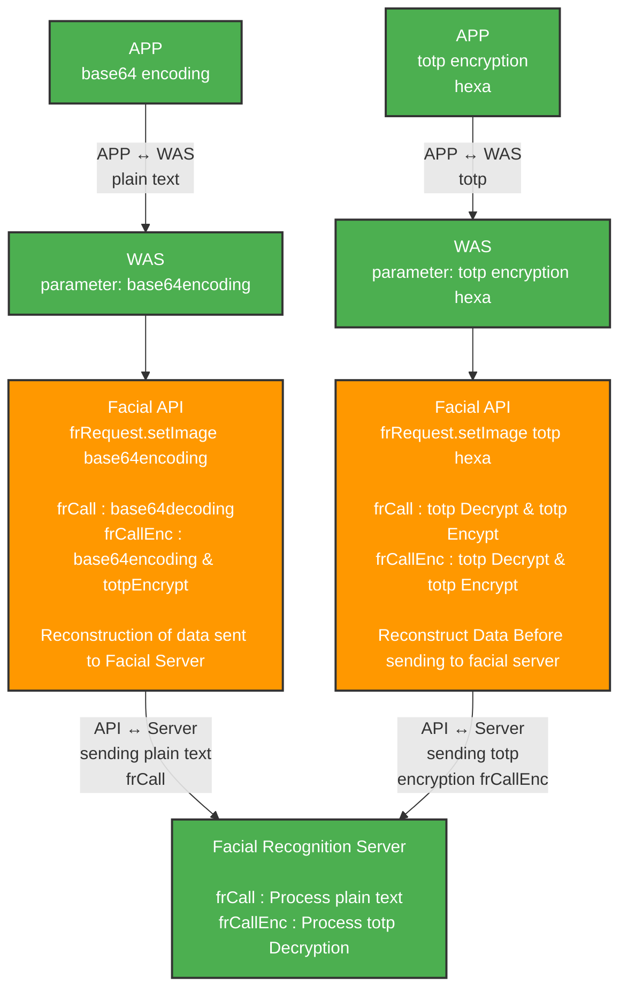

# Metsakuur Face Recognition Service API Documentation
MKFR API GUIDE v1.5.9


## Table of Contents
1. [Service Introduction](#1-service-introduction)
2. [API Classes](#2-api-classes)
3. [API Services](#3-api-services)
4. [TOTP Encryption Communication Guide](#4-totp-encryption-communication-guide)
5. [Face Registration (REGIST) Service](#5-face-registration-regist-service)
6. [Face Registration (REGIST_T) Service](#6-face-registration-regist_t-service)
7. [Face Delete (DELETE) Service](#7-face-delete-delete-service)
8. [Face Verification (VERIFY) Service](#8-face-verification-verify-service)
9. [Face Verification (VERIFY_T) Service](#9-face-verification-verify_t-service)
10. [Face 1:N Verification (BULKVERIFY) Service](#10-face-1n-verification-bulkverify-service)
11. [Face Authentication Status Check (CHECK) Service](#11-face-authentication-status-check-check-service)
12. [ID Card Face Comparison (UNTACT) Service](#12-id-card-face-comparison-untact-service)
13. [ID Card Face Comparison Registration (REGIST_U) Service](#13-id-card-face-comparison-registration-regist_u-service)
14. [Passport OCR (PASSPORT_OCR) Service](#14-passport-ocr-passport_ocr-service)
15. [ID Card Face Comparison (UNTACT_NODB) Service](#15-id-card-face-comparison-untact_nodb-service)
16. [Template Extraction (TEMPLATE) Service](#16-template-extraction-template-service)
17. [Template Comparison (TEMPLATE_VERIFY) Service](#17-template-comparison-template_verify-service)
18. [Response Code Policy](#18-response-code-policy)
19. [Server Response Examples](#19-server-response-examples)
20. [SO File Configuration](#20-so-file-configuration)
21. [iOS/Android Device Name Extraction](#21-iosandroid-device-name-extraction)
22. [Additional Explanation of Face Recognition Options](#22-additional-explanation-of-face-recognition-options)

---

## 1. Service Introduction

This document provides a comprehensive guide to using the Face Recognition Service APIs provided by **Metsakuur Company**, including services such as:

   - Face Registration (<span style="color:green">REGIST</span>)
   - Face Template Registration (<span style="color:green">REGIST_T</span>)
   - Face Deletion (<span style="color:green">DELETE</span>)
   - Face Verification (<span style="color:green">VERIFY</span>, <span style="color:green">VERIFY_T</span>)
   - Face 1:N Verification (<span style="color:green">BULKVERIFY</span>)
   - Face Authentication Status Check (<span style="color:green">CHECK</span>)
   - ID Card Face Comparison (<span style="color:green">UNTACT</span>, <span style="color:blue">UNTACT_NODB</span>)
   - ID Card Face Registration (<span style="color:green">REGIST_U</span>)
   - Passport OCR (<span style="color:blue">PASSPORT_OCR</span>)
   - Template Extraction(<span style="color:blue">TEMPLATE</span>)
   - Template Comparison (<span style="color:blue">TEMPLATE_VERIFY</span>)

Legend:
><span style="color:green">`SERVICE_CODE`</span>: Uses Metsakuur DB
<br/><span style="color:blue">`SERVICE_CODE`</span>: Does NOT use Metsakuur DB
---

## 2. API Classes


| No | Class           | Description |
|----|------------------|-------------|
| 1  | FrRequest        | Facial recognition request parameter class |
| 2  | FrResponse       | Facial recognition response class |
| 3  | EzResponse       | Facial recognition server response class |
| 4  | MkFrService      | Facial recognition service class |

---

## 3. API Services

```java
com.metsakuur.face.service.MkFrService
```

| No | Name         | Description |
|----|--------------|-------------|
| 1  | frCall       | Send plain data(base 64 encoded img) when calling the face recognition service (when `libMKtotp.so` is not available or using plain text option) |
| 2  | frCallEnc    | Transmit using Metsakuur TOTP encryption when calling the face recognition service (requires `libMKtotp.so`) |
| 3  | frTotpDecryptData | Function used by the client to decrypt data transmitted using Metsakuur TOTP encryption |

> Use `frCall` in development environments where `libMKtotp.so` is not available.
> Use `frCallEnc` in production Linux servers where encryption is required.

## 4. TOTP encryption communication guide

#### Option 1: Base64 Encoding
- APP sends image as base64 encoded data
- WAS processes and forwards to recognition server
- Simple encoding/decoding at each layer

#### Option 2: TOTP Encryption
- APP can send encrypted data using TOTP (Time-based One-Time Password)
- WAS handles encryption/decryption as needed
- Provides additional security layer

### Encryption Flexibility

The system allows different encryption combinations:
- **APP → WAS**: Can be plaintext or encrypted
- **WAS → Recognition Server**: Can be plaintext or encrypted
- Each segment can independently use encryption based on security requirements

### Key Functions
- **frCall()**: Processes plain text data
- **frCallEnc()**: Handles encrypted data with TOTP decryption/encryption

### Totp Decryption Request Class

```java
com.metsakuur.face.service.MKFrService
com.metsakuur.face.model.FrRequest
com.metsakuur.face.enums.TotpType
```

| No | Name   | Type     | Required | Description |
|----|--------|----------|----------|-------------|
| 1  | data   | String   | Y        | TOTP encrypted data passed to the client |
| 2  | TotpType | TotpType | Y        | Encryption type: `IMAGE`, `IMAGE_DEPTH`, `IMAGE_ID`, `FEATURE` |

### Response
```java
Byte[] test = frTotpDecryptData(String data, TotpType.IMAGE);
```

### Example Usage

```java
try {
    MkFrService mkfrService = new MkFrService();
    if(true){
        // selfie image
        byte[] decryptImage = mkfrSrvice.frTotpDecryptData(image, TotpType.IMAGE);
        // ID card image
        byte[] decryptImageId = mkfrSrvice.frTotpDecryptData(idimage, TotpType.IMAGE_ID);
    }
} catch (Exception e) {
    System.out.println(e.toString());
}
```

---

## 5. Face Registration (REGIST) Service
> The Face recognition Registration Service (REGIST) is a service that extracts and registers facial features of a face image from a Face recognition server.

### Request Parameter Class

```java
com.metsakuur.face.model.FrRequest
com.metsakuur.face.enums.ServiceType
com.metsakuur.face.enums.OsType
```

### Face Authentication API Parameters

| No | Name | Type | Required | Digits | Description | Remarks |
|---|---|---|---|---|---|---|
| 1 | IP | String | Y | | Face authentication server IP and host | |
| 2 | Port | Int | Y | | Face authentication server port number | EX) 15270 |
| 3 | Timeout | Int | N | | Face authentication server timeout (in seconds) | EX) 10 |
| 4 | serviceType | ServiceType | Y | | Face recognition service type | "REGIST" (Fixed) |
| 5 | uuid | String | Y | 16 | Company Identifier (Unique) | EX) "UFACE" (Company's English name) |
| 6 | chnlDv | String | Y | 3 | Channel Classification (PK) | Up to 3 digits EX)"MET" (Administrator setup required. Contact your representative) |
| 7 | custNo | String | Y | 100 | Customer number (PK) | Facial recognition ID up to 100 digits |
| 8 | custName | String | Y | 50 | Customer name | Up to 50 digits. Enter "No" if there is a security policy issue |
| 9 | osType | OsType | Y | 3 | OS Type (image OS) | WIN: Windows <br/> LIX: Linux <br/> IOS: iOS <br/> AND: Android <br/> ETC: Other |
| 10 | image | String | Y | | Selfie image | Plain text: Base64 encoding Data, TOTP encryption: see guide below |
| 11 | depthImage | String | N | | Selfie depth image (iOS APP - Depth for available models only) | Plain text: Base64 encoding Data, TOTP encryption: see guide below |
| 12 | deviceName | String | N | 150 | Device Name | Extract iOS and Android device names (See later in the guide) |
| 13 | checkSunglass | int | N | | Whether to check sunglasses (only used in special cases) | default: 1, checked: 1, unchecked: 0 |
| 14 | checkMask | int | N | | Whether to check the mask (only used in special cases) | default: 1, checked: 1, unchecked: 0 |
| 15 | checkSpoofing | int | N | | Whether to check spoofing (only used in special cases) | default: 1, checked: 1, unchecked: 0 |
| 16 | checkDepth | int | N | | Whether to check depth img (only used in special cases) | default: 1, checked: 1, unchecked: 0 |
| 17 | checkEyeblink | int | N | | Whether to check eye blink (only used in special cases) | default: 0, checked: 1, unchecked: 0 |
| 18 | checkObject | int | N | | Whether to check the object (only used in special cases) | default: 1, checked: 1, unchecked: 0 |

-   `chnlDv` (3 digits) / `custNo` (100 digits) correspond to the primary key. Please note that it is managed by channel classification.

- Face image/face depth image is used to store the
Mesakur Totp encrypted data: When using the totp encryption module, you can use the hexa character generated by the module as a literal parameter. 
Without Totp encryption: Use Base64 encoded characters as parameters.

- checkSunglass , checkMask, checkSpoofing, checkDepth, checkEyeblink, checkObject options should be defaulted to the server-side DB managed values, and the option values should be ignored and used only if the client's special situation requires it. (Required check by the person in charge when using)

---

### Face recognition registration service response class: 
`com.metsakuur.face.model.FrResponse`

| No | Name       | Description                              |
|----|------------|------------------------------------------|
| 1  | Code       | `OK`: Success\<br\>`FAIL`: Failed\<br\>`ERROR`: Error |
| 2  | Msg        | Response message                         |
| 3  | EzResponse | Facial recognition server response result |

---

### Face recognition server registration response class: 
`com.metsakuur.face.ez.model.EzResponse`

| No | Name           | Description                     |
|----|----------------|---------------------------------|
| 1  | resp\_code      | Response code                   |
| 2  | resp\_msg       | Response message                |
| 3  | resp\_score     | Authentication score            |
| 4  | resp\_cust\_no   | Customer number                 |
| 5  | resp\_chnl\_dv   | Channel classification          |
| 6  | resp\_age       | Age of extracted photo          |
| 7  | resp\_gender    | Gender of extracted photo       |
| 8  | resp\_threshold | Authentication score threshold value |

### Request Sample Code

```java
//REGIST Sample
MkFrService mkFrService = new MkFrService();
FrRequest frRequest = new FrRequest();
FrResponse frResponse = new FrResponse();

frRequest.setIp("000.000.000.000");         //Facial recognition server ip
frRequest.setPort(15270);                   //Facial recognition server port
frRequest.setOsType(OsType.IOS);            //OS type
frRequest.setServiceType(ServiceType.REGIST); //API Service Type
frRequest.setUuid("UFACE");                 //UFACE or Company Identifier
frRequest.setChnl_dv("ADT");                //PK1 (3-digit channel: Message Metsakuur representative)
frRequest.setCustNo("0123456789");          //PK2 (Customer number or identification number, 100 digits) 
frRequest.setCustName("고객명");             //Customer Name (optional) 
frRequest.setImage("Ajbkjdkfjkasdfasdf...."); //selfie image(base64)

frResponse = mkFrService.frCall(frRequest);
System.out.println(new Gson().toJson(frResponse));
```

---

### Sample Response

```json
{
  "code": "OK",
  "msg": "OK",
  "ezResponse": {
    "resp_code": "00000",
    "resp_msg": "OK",
    "resp_score": "0",
    "resp_age": "41",
    "resp_gender": "M",
    "resp_threshold": "0",
    "resp_cust_no": "0123456789",
    "resp_chnl_dv": "ADT",
    "resp_name": "고객 명"
  }
}
```
---

## 6. Face Registration (REGIST_T) Service
> The Face registration service (REGIST_T) is a service that extracts a face image from a client and registers the template on the face recognition server.

### Request Parameter Class

```java
com.metsakuur.face.model.FrRequest
com.metsakuur.face.enums.ServiceType
com.metsakuur.face.enums.OsType
com.metsakuur.face.enums.GenderType
com.metsakuur.face.enums.EgVersionType
```

| No | Name | Type | Required | Digits | Description | Remarks |
|---|---|---|---|---|---|---|
| 1 | IP | String | Y | | Face authentication server IP and host | |
| 2 | Port | Int | Y | | Face authentication server port number | EX) 15270 |
| 3 | Timeout | Int | N | | Face Recognition Server time (in seconds) | EX) 10 |
| 4 | serviceType | ServiceType | Y | | Face recognition service type | **"REGIST_T" (Fixed)** |
| 5 | uuid | String | Y | 16 | Company unique key | EX) "UFACE" (Company's **English** name) |
| 6 | chnlDv | String | Y | 3 | Channel Classification (PK) | Up to 3 digits EX)"MET" (Administrator setup required. Contact your supervisor) |
| 7 | custNo | String | Y | 100 | Customer number (PK) | Facial recognition ID up to 100 digits |
| 8 | osType | OsType | Y | 3 | OS Type (image OS) | WIN: Windows <br/> LIX: Linux <br/> IOS: iOS <br/> AND: Android <br/> ETC: Other |
| 9 | feature | String | Y | | Face shot Template data | Plain text: Base64 encoding Data, TOTP encryption: See guide below |
| 10 | age | String | Y | 3 | Age | Age when extracting the face shot. Fixed to "0" if policy prohibits it. |
| 11 | gender | GenderType | Y | 1 | Gender | Age at the time of extracting the face shot. Fixed "X" if not allowed by policy |
| 12 | egVersion | EgVersionType | Y | 15 | Engine Version | **"EXTRACTV4" (Fixed)** |

>   `chnlDv` (3 digits) / `custNo` (100 digits) correspond to the primary key. Please note that it is managed by channel classification.
> When using Totp encrypted data you can use hexa code generated by the module as a literal parameter.
> Use Base64 if not using TOTP encryption.

---
### Face recognition registration service response class: 
`com.metsakuur.face.model.FrResponse`

| No | Name       | Description                              |
|----|------------|------------------------------------------|
| 1  | Code       | `OK`: Success\<br\>`FAIL`: Failed\<br\>`ERROR`: Error |
| 2  | Msg        | Response message                         |
| 3  | EzResponse | Facial recognition server response result |

-----

### Face recognition server registration response class: 
`com.metsakuur.face.ez.model.EzResponse`

| No | Name           | Description                     |
|----|----------------|---------------------------------|
| 1  | resp\_code      | Response code                   |
| 2  | resp\_msg       | Response message                |
| 3  | resp\_score     | Authentication score            |
| 4  | resp\_cust\_no   | Customer number                 |
| 5  | resp\_chnl\_dv   | Channel classification          |
| 6  | resp\_age       | Age of extracted photo          |
| 7  | resp\_gender    | Gender of extracted photo       |
| 8  | resp\_threshold | Authentication score threshold value |


### Sample Code

```java
MkFrService mkFrService = new MkFrService();
FrRequest frRequest = new FrRequest();
FrResponse frResponse = new FrResponse();

// REGIST_T Sample
frRequest.setIp("000.000.000.000");         //Facial recognition server ip
frRequest.setPort(15270);                   //Facial recognition server port
frRequest.setOsType(OsType.IOS);            //OS type
frRequest.setServiceType(ServiceType.REGIST_T); //API Service Type
frRequest.setUuid("UFACE");                 //UFACE or Company Identifier
frRequest.setChnl_dv("ADT");                //PK1 (3-digit channel: Message Metsakuur representative)
frRequest.setCustNo("0123456789");          //PK2 (Customer number or identification number, 100 digits) 
frRequest.setFeature("Ajbkjdkfjkasdfasdf...."); //base64 or Totp
frRequest.setAge("50");                     //Age
frRequest.setGender(GenderType.M);          //Gender
frRequest.setEgVersion(EgVersionType.EXTRACTV4); //Engine Version

frResponse = mkFrService.frCall(frRequest);
System.out.println(new Gson().toJson(frResponse));
```

---

### Sample Response

```json
{
  "code": "OK",
  "msg": "OK",
  "ezResponse": {
    "resp_code": "00000",
    "resp_msg": "OK",
    "resp_score": "0",
    "resp_age": "50",
    "resp_gender": "M",
    "resp_threshold": "0",
    "resp_cust_no": "0123456789",
    "resp_chnl_dv": "ADT",
    "resp_name": "고객 명"
  }
}
```

---

## 7. Face Delete (DELETE) Service
> The face delete service deletes registered face customer information and features. Features are biometric data, so they are actually deleted.
### Request Parameter Class
```java
com.metsakuur.face.model.FrRequest
com.metsakuur.face.enums.ServiceType
com.metsakuur.face.enums.OsType
```


| No | Name | Type | Required | Digits | Description | Remarks |
|---|---|---|---|---|---|---|
| 1 | IP | String | Y | | Face authentication server IP and host | |
| 2 | Port | Int | Y | | Face authentication server port number | EX) 15270 |
| 3 | Timeout | Int | N | | Face authentication server timeout (in seconds) | EX) 10 |
| 4 | serviceType | ServiceType | Y | | Face recognition service type | "DELETE" (Fixed) |
| 5 | uuid | String | Y | 16 | Company Identifier (Unique) | EX) "UFACE" (Company's English name) |
| 6 | chnlDv | String | Y | 3 | Channel Classification (PK) | Up to 3 digits EX)"MET" (Administrator setup required. Contact your representative) |
| 7 | custNo | String | Y | 100 | Customer number (PK) | Facial recognition ID up to 100 digits |
| 8 | osType | OsType | Y | 3 | OS Type (image OS) | WIN: Windows <br/> LIX: Linux <br/> IOS: iOS <br/> AND: Android <br/> ETC: Other |

>   `chnlDv` (3 digits) / `custNo` (100 digits) correspond to the primary key. Please note that it is managed by channel classification.

---

### Face recognition server deletion response class:
`com.metsakuur.face.ez.model.FrResponse`

| No | Name       | Description                              |
|----|------------|------------------------------------------|
| 1  | Code       | `OK`: Success\<br\>`FAIL`: Failed\<br\>`ERROR`: Error |
| 2  | Msg        | Response message                         |
| 3  | EzResponse | Facial recognition server response result |

---
### Face recognition server registration response class: 
`com.metsakuur.face.ez.model.EzResponse`

| No | Name           | Description                     |
|----|----------------|---------------------------------|
| 1  | resp\_code      | Response code                   |
| 2  | resp\_msg       | Response message                |
| 3  | resp\_score     | Authentication score            |
| 4  | resp\_cust\_no   | Customer number                 |
| 5  | resp\_chnl\_dv   | Channel classification          |
| 6  | resp\_age       | Age of extracted photo          |
| 7  | resp\_gender    | Gender of extracted photo       |
| 8  | resp\_threshold | Authentication score threshold value |

---
### Sample Code

```java
//DELETE Sample
MkFrService mkFrService = new MkFrService();
FrRequest frRequest = new FrRequest();
FrResponse frResponse = new FrResponse();

frRequest.setIp("000.000.000.000");         //Facial recognition server ip
frRequest.setPort(15270);                   //Facial recognition server port
frRequest.setOsType(OsType.IOS);            //OS type
frRequest.setServiceType(ServiceType.DELETE); //API Service Type
frRequest.setUuid("UFACE");                 //UFACE or Company Identifier
frRequest.setChnl_dv("ADT");                //PK1 (3-digit channel: Message Metsakuur representative)
frRequest.setCustNo("0123456789");          //PK2 (Customer number or identification number, 100 digits) 

frResponse = mkFrService.frCall(frRequest);
System.out.println(new Gson().toJson(frResponse));
```

---

### Sample Response

```json
{
  "code": "OK",
  "msg": "OK",
  "ezResponse": {
    "resp_code": "00000",
    "resp_msg": "OK",
    "resp_score": "0",
    "resp_age": "",
    "resp_gender": "",
    "resp_threshold": "0",
    "resp_cust_no": "0123456789",
    "resp_chnl_dv": "ADT",
    "resp_name": ""
  }
}
```

---

## 8. Face Verification (VERIFY) Service
> This is a verification service that compares facial recognition registration data with a face image.

### Request Parameter Class

```java
com.metsakuur.face.model.FrRequest
com.metsakuur.face.enums.ServiceType
com.metsakuur.face.enums.OsType
```

### Face Verification API parameters

| No | Name | Type | Required | Digits | Description | Remarks |
|---|---|---|---|---|---|---|
| 1 | IP | String | Y | | Face authentication server IP and host | |
| 2 | Port | Int | Y | | Face authentication server port number | EX) 15270 |
| 3 | Timeout | Int | N | | Face authentication server timeout (in seconds) | EX) 10 |
| 4 | serviceType | ServiceType | Y | | Face recognition service type | "REGIST" (Fixed) |
| 5 | uuid | String | Y | 16 | Company Identifier (Unique) | EX) "UFACE" (Company's English name) |
| 6 | chnlDv | String | Y | 3 | Channel Classification (PK) | Up to 3 digits EX)"MET" (Administrator setup required. Contact your representative) |
| 7 | custNo | String | Y | 100 | Customer number (PK) | Facial recognition ID up to 100 digits |
| 8 | osType | OsType | Y | 3 | OS Type (image OS) | WIN: Windows <br/> LIX: Linux <br/> IOS: iOS <br/> AND: Android <br/> ETC: Other |
| 9| image | String | Y | | Selfie image | Plain text: Base64 encoding Data, TOTP encryption: see guide below |
| 10 | depthImage | String | N | | Selfie depth image (iOS APP - Depth for available models only) | Plain text: Base64 encoding Data, TOTP encryption: see guide below |
| 11 | checkSunglass | int | N | | Whether to check sunglasses (only used in special cases) | default: 1, checked: 1, unchecked: 0 |
| 12 | checkMask | int | N | | Whether to check the mask (only used in special cases) | default: 1, checked: 1, unchecked: 0 |
| 13 | checkSpoofing | int | N | | Whether to check spoofing (only used in special cases) | default: 1, checked: 1, unchecked: 0 |
| 14 | checkDepth | int | N | | Whether to check depth img (only used in special cases) | default: 1, checked: 1, unchecked: 0 |
| 15 | checkEyeblink | int | N | | Whether to check eye blink (only used in special cases) | default: 0, checked: 1, unchecked: 0 |
| 16 | checkObject | int | N | | Whether to check the object (only used in special cases) | default: 1, checked: 1, unchecked: 0 |

>   `chnlDv` (3 digits) / `custNo` (100 digits) correspond to the primary key. Please note that it is managed by channel classification.

* Face image/face depth image is used to store the
Mesakur Totp encrypted data: When using the totp encryption module, you can use the hexa character generated by the module as a literal parameter. 
Without Totp encryption: Use Base64 encoded characters as parameters.

* checkSunglass , checkMask, checkSpoofing, checkDepth, checkEyeblink, checkObject options should be defaulted to the server-side DB managed values, and the option values should be ignored and used only if the client's special situation requires it. (Required check by the person in charge when using)


---

### Face recognition 1:1 registration service response class:
`com.metsakuur.face.model.FrResponse`

| No | Name       | Description                              |
|----|------------|------------------------------------------|
| 1  | Code       | `OK`: Success\<br\>`FAIL`: Failed\<br\>`ERROR`: Error |
| 2  | Msg        | Response message                         |
| 3  | EzResponse | Facial recognition server response result |

---

### Face recognition server 1:1 registration response class:
`com.metsakuur.face.ez.model.EzResponse`

| No | Name           | Description                     |
|----|----------------|---------------------------------|
| 1  | resp\_code      | Response code                   |
| 2  | resp\_msg       | Response message                |
| 3  | resp\_score     | Authentication score            |
| 4  | resp\_cust\_no   | Customer number                 |
| 5  | resp\_chnl\_dv   | Channel classification          |
| 6  | resp\_age       | Age of extracted photo          |
| 7  | resp\_gender    | Gender of extracted photo       |
| 8  | resp\_threshold | Authentication score threshold value |


### Sample Code

```java
//VERIFY Sample
MkFrService mkFrService = new MkFrService();
FrRequest frRequest = new FrRequest();
FrResponse frResponse = new FrResponse();

frRequest.setIp("000.000.000.000");         //Facial recognition server ip
frRequest.setPort(15270);                   //Facial recognition server port
frRequest.setOsType(OsType.IOS);            //OS type
frRequest.setServiceType(ServiceType.VERIFY); //API Service Type
frRequest.setUuid("UFACE");                 //UFACE or Company Identifier
frRequest.setChnl_dv("ADT");                //PK1 (3-digit channel: Message Metsakuur representative)
frRequest.setCustNo("0123456789");          //PK2 (Customer number or identification number, 100 digits) 
frRequest.setCustName("고객명");             //Customer Name (optional) 
frRequest.setImage("Ajbkjdkfjkasdfasdf...."); //selfie image(base64)

frResponse = mkFrService.frCall(frRequest);
System.out.println(new Gson().toJson(frResponse));
```

---

### Sample Response

```json
{
  "code": "OK",
  "msg": "OK",
  "ezResponse": {
    "resp_code": "00000",
    "resp_msg": "OK",
    "resp_score": "100",
    "resp_age": "41",
    "resp_gender": "M",
    "resp_threshold": "60",
    "resp_cust_no": "0123456789",
    "resp_chnl_dv": "ADT",
    "resp_name": "고객명"
  }
}
```

---

## 9. Face Verification (VERIFY_T) Service
> This service verifies the face recognition enrollment template against the selfie template extracted from the client.

### Request Parameter Class

```java
com.metsakuur.face.model.FrRequest
com.metsakuur.face.enums.ServiceType
com.metsakuur.face.enums.OsType
com.metsakuur.face.enums.GenderType
com.metsakuur.face.enums.EgVersionType
```

### Face Verification API parameters

| No | Name | Type | Required | Digits | Description | Remarks |
|---|---|---|---|---|---|---|
| 1 | IP | String | Y | | Face authentication server IP and host | |
| 2 | Port | Int | Y | | Face authentication server port number | EX) 15270 |
| 3 | Timeout | Int | N | | Face authentication server timeout (in seconds) | EX) 10 |
| 4 | serviceType | ServiceType | Y | | Face recognition service type | "REGIST" (Fixed) |
| 5 | uuid | String | Y | 16 | Company Identifier (Unique) | EX) "UFACE" (Company's English name) |
| 6 | chnlDv | String | Y | 3 | Channel Classification (PK) | Up to 3 digits EX)"MET" (Administrator setup required. Contact your representative) |
| 7 | custNo | String | Y | 100 | Customer number (PK) | Facial recognition ID up to 100 digits |
| 8 | osType | OsType | Y | 3 | OS Type (image OS) | WIN: Windows <br/> LIX: Linux <br/> IOS: iOS <br/> AND: Android <br/> ETC: Other |
| 9 | feature | String | Y | | Face shot Template data | Plain text: Base64 encoding Data, TOTP encryption: See guide below |
| 10 | age | String | Y | 3 | Age | Age when extracting the face shot. Fixed to "0" if policy prohibits it. |
| 11 | gender | GenderType | Y | 1 | Gender | Gender when extracting the face shot. Fixed "X" if policy prohibits it.|
| 12 | egVersion | EgVersionType | Y | 15 | Engine Version | **"EXTRACTV4" (Fixed)** |

>   `chnlDv` (3 digits) / `custNo` (100 digits) correspond to the primary key. Please note that it is managed by channel classification.

* Feature (Template data) is 
For Metsakuur Totp encrypted data: When using the totp encryption module, you can use the hexa character generated by the module as a literal parameter. When not using Totp encryption: Use Base64 encoded characters as parameters.

---

### Face recognition 1:1 registration service response class:
`com.metsakuur.face.model.FrResponse`

| No | Name       | Description                              |
|----|------------|------------------------------------------|
| 1  | Code       | `OK`: Success\<br\>`FAIL`: Failed\<br\>`ERROR`: Error |
| 2  | Msg        | Response message                         |
| 3  | EzResponse | Facial recognition server response result |

---

### Face recognition server 1:1 registration response class:
`com.metsakuur.face.ez.model.EzResponse`

| No | Name           | Description                     |
|----|----------------|---------------------------------|
| 1  | resp\_code      | Response code                   |
| 2  | resp\_msg       | Response message                |
| 3  | resp\_score     | Authentication score            |
| 4  | resp\_cust\_no   | Customer number                 |
| 5  | resp\_chnl\_dv   | Channel classification          |
| 6  | resp\_age       | Age of extracted photo          |
| 7  | resp\_gender    | Gender of extracted photo       |
| 8  | resp\_threshold | Authentication score threshold value |


### Sample Code

```java
//VERIFY-T Sample
MkFrService mkFrService = new MkFrService();
FrRequest frRequest = new FrRequest();
FrResponse frResponse = new FrResponse();

frRequest.setIp("000.000.000.000"); 		// Facial recognition server IP
frRequest.setPort(15270); 			// Facial recognition server port

frRequest.setOsType(OsType.IOS); // OS Type 
frRequest.setServiceType(ServiceType.VERIFY_T); 	// API Service Type 

frRequest.setUuid("UFACE"); 			// UFACE or Business UUID
frRequest.setChnl_dv("ADT"); 	// PK1 (3-digit channel: Message Metsakuur representative)
frRequest.setCustNo("0123456789"); 	// PK2 (Customer number or 100-digit identification number)

frRequest.setFeature("Ajbkjdkfjkfasdfasdf...."); 	// Client side facial feature (base64 or totp) 
frRequest.setAge("50"); 			// Not required set 0 if not going to use
frRequest.setGender(GenderType.M); 		// Not required set M if not going to use
frRequest.setEgVersion(EgVersionType.EXTRACTV4); 	// EXTRACTV4 or ask representative

frResponse = mkFrService.frCall(frRequest);
System.out.println(new Gson().toJson(frResponse));
```

---

### Sample Response

```json
{
  "code": "OK",
  "msg": "OK",
  "ezResponse": {
    "resp_code": "00000",
    "resp_msg": "OK",
    "resp_score": "100",
    "resp_age": "41",
    "resp_gender": "M",
    "resp_threshold": "60",
    "resp_cust_no": "0123456789",
    "resp_chnl_dv": "ADT",
    "resp_name": "고객명"
  }
}
```

---
### Request Parameters

---

## 10. Face 1:N Verification (BULKVERIFY) Service
> This is a verification service that compares all data registered as facial recognition with a selfie image. 1:N verification compares all data registered for facial recognition with the captured image to find a matching customer. If there is no matching data in the response, there is no customer number value, and you can know similar data through batch_ids. Batch_ids can be utilized as reference data.

### Request Parameter Classes
```java
com.metsakuur.face.model.FrRequest
com.metsakuur.face.enums.ServiceType
com.metsakuur.face.enums.OsType
```

### Face Verification 1:N API Parameters
| No | Name | Type | Required | Digits | Description | Remarks |
|---|---|---|---|---|---|---|
| 1 | IP | String | Y | | Face authentication server IP and host | |
| 2 | Port | Int | Y | | Face authentication server port number | EX) 15270 |
| 3 | Timeout | Int | N | | Face authentication server timeout (in seconds) | EX) 10 |
| 4 | serviceType | ServiceType | Y | | Face recognition service type | "REGIST" (Fixed) |
| 5 | uuid | String | Y | 16 | Company Identifier (Unique) | EX) "UFACE" (Company's English name) |
| 6 | chnlDv | String | Y | 3 | Channel Classification (PK) | Up to 3 digits EX)"MET" (Administrator setup required. Contact your representative) |
| 7 | osType | OsType | Y | 3 | OS Type (image OS) | WIN: Windows <br/> LIX: Linux <br/> IOS: iOS <br/> AND: Android <br/> ETC: Other |
| 8 | image | String | Y | | Selfie image | Plain text: Base64 encoding Data, TOTP encryption: see guide below |
| 9 | depthImage | String | N | | Selfie depth image (iOS APP - Depth for available models only) | Plain text: Base64 encoding Data, TOTP encryption: see guide below |
| 10 | deviceName | String | N | 150 | Device Name | Extract iOS and Android device names (See end of guide) |

* For face image/face depth image, 
Metsakuur Totp encrypted data : When using the totp encryption module, you can use the hexa characters generated by the module as parameters. 
Without Totp encryption: Use Base64 encoded characters as a parameter.

### Face recognition 1:N registration service response class:
| No | Name       | Description                              |
|----|------------|------------------------------------------|
| 1  | Code       | `OK`: Success\<br\>`FAIL`: Failed\<br\>`ERROR`: Error |
| 2  | Msg        | Response message                         |
| 3  | EzResponse | Facial recognition server response result |

---

### Face recognition server 1:N registration response class:
| No | Name           | Description                     |
|----|----------------|---------------------------------|
| 1  | resp\_code      | Response code                   |
| 2  | resp\_msg       | Response message                |
| 3  | resp\_score     | Authentication score            |
| 4  | resp\_cust\_no   | Customer number                 |
| 5  | resp\_chnl\_dv   | Channel classification          |
| 6  | resp\_age       | Age of extracted photo          |
| 7  | resp\_gender    | Gender of extracted photo       |
| 8  | resp\_threshold | Authentication score threshold value |

---

### Sample Code

```java
//BULKVERIFY Sample
MkFrService mkFrService = new MkFrService();
FrRequest frRequest = new FrRequest();
FrResponse frResponse = new FrResponse();

frRequest.setIp("000.000.000.000"); 			// Facial Recognition Server IP
frRequest.setPort(15270); 				// Facial Recognition Server Port

frRequest.setOsType(OsType.IOS); 			// OS Type
frRequest.setServiceType(ServiceType.BULKVERIFY); 	// API Service Type

frRequest.setUuid("UFACE"); 			// UFACE or Business UUID
frRequest.setChnl_dv("ADT"); 	// PK1 (3-digit channel: Message Metsakuur representative)
frRequest.setCustNo("0123456789"); 	// PK2 (Customer number or 100-digit identification number)

frRequest.setImage("Ajbkjdkfjkfasdf...."); 		// Base64 selfie image

frResponse = mkFrService.frCall(frRequest);

System.out.println(new Gson().to
```

---

### Sample Response

```json
{
  "code": "OK",
  "msg": "OK",
  "ezResponse": {
    "resp_code": "00000",
    "resp_msg": "OK",
    "resp_score": "100",
    "resp_age": "41",
    "resp_gender": "M",
    "resp_threshold": "60",
    "resp_cust_no": "0123456789",
    "resp_chnl_dv": "ADT",
    "resp_name": "고객명"
  }
}
```

---

## 11. Face Authentication Status Check (CHECK) Service
> This service checks whether facial recognition features are registered.

### Request Parameter Class
```java
com.metsakuur.face.model.FrRequest
com.metsakuur.face.enums.ServiceType
com.metsakuur.face.enums.OsType
```

### Face Authentication API Parameters
| No | Name | Type | Required | Digits | Description | Remarks |
|---|---|---|---|---|---|---|
| 1 | IP | String | Y | | Face authentication server IP and host | |
| 2 | Port | Int | Y | | Face authentication server port number | EX) 15270 |
| 3 | Timeout | Int | N | | Face authentication server timeout (in seconds) | EX) 10 |
| 4 | serviceType | ServiceType | Y | | Face recognition service type | "CHECK" (Fixed) |
| 5 | uuid | String | Y | 16 | Company Identifier (Unique) | EX) "UFACE" (Company's English name) |
| 6 | chnlDv | String | Y | 3 | Channel Classification (PK) | Up to 3 digits EX)"MET" (Administrator setup required. Contact your representative) |
| 7 | custNo | String | Y | 100 | Customer number (PK) | Facial recognition ID up to 100 digits |
| 8 | osType | OsType | Y | 3 | OS Type (image OS) | WIN: Windows <br/> LIX: Linux <br/> IOS: iOS <br/> AND: Android <br/> ETC: Other |

>   `chnlDv` (3 digits) / `custNo` (100 digits) correspond to the primary key. Please note that it is managed by channel classification.

---

### Face recognition status check response class:
| No | Name           | Description                     |
|----|----------------|---------------------------------|
| 1 | code | OK : Success<br>FAIL : Failed<br>ERROR : Error | 
| 2 | msg | Response message | 
| 3 | ezResponse | Facial recognition server response result |

---
### Face recognition server status check response class:
| No | Name           | Description                     |
|----|----------------|---------------------------------|
| 1 | resp\_code      | Response code                   |
| 2 | resp\_msg       | Response message                |
| 3 | resp\_score     | Authentication score            |
| 4 | resp\_cust_no   | Customer number                 |
| 5 | resp\_chnl\_dv   | Channel classification          |
| 6 | resp\_age       | Age of extracted photo          |
| 7 | resp\_gender    | Gender of extracted photo       |
| 8 | resp\_threshold | Authentication score threshold value |

---
### Sample Code

```java
//CHECK Sample
MkFrService mkFrService = new MkFrService();
FrRequest frRequest = new FrRequest();
FrResponse frResponse = new FrResponse();

frRequest.setIp("000.000.000.000"); 			// Facial Recognition Server IP
frRequest.setPort(15270); 				// Facial Recognition Server Port

frRequest.setOsType(OsType.IOS); 			// OS Type
frRequest.setServiceType(ServiceType.CHECK); 		// API Service Type

frRequest.setUuid("UFACE"); 				// UFACE or Business UUID
frRequest.setChnl_dv("ADT"); 	// PK1 (3-digit channel: Message Metsakuur representative)
frRequest.setCustNo("0123456789"); 	// PK2 (Customer number or 100-digit identification number)

frResponse = mkFrService.frCall(frRequest);

System.out.println(new Gson().toJson(frResponse));
```

---

### Sample Response

```json
{
  "code": "OK",
  "msg": "OK",
  "ezResponse": {
    "resp_code": "00000",
    "resp_msg": "OK",
    "resp_score": "0",
    "resp_age": "",
    "resp_gender": "",
    "resp_threshold": "0",
    "resp_cust_no": "0123456789",
    "resp_chnl_dv": "ADT",
    "resp_name": ""
  }
}
```

---

## 12. ID Card Face Comparison (UNTACT) Service
> The facial recognition ID comparison verification service is a verification service that compares ID images and mugshot images. It responds with the result after comparison and does not have a registration function.


### Request Parameter Class
```java
com.metsakuur.face.model.FrRequest
com.metsakuur.face.enums.ServiceType
com.metsakuur.face.enums.OsType
com.metsakuur.face.enums.UntactType
```


### Face ID comparison API parameters
| No | Name | Type | Required | Digits | Description | Remarks |
|---|---|---|---|---|---|---|
| 1 | IP | String | Y | | Face authentication server IP and host | |
| 2 | Port | Int | Y | | Face authentication server port number | EX) 15270 |
| 3 | Timeout | Int | N | | Face authentication server timeout (in seconds) | EX) 10 |
| 4 | serviceType | ServiceType | Y | | Face recognition service type | "CHECK" (Fixed) |
| 5 | uuid | String | Y | 16 | Company Identifier (Unique) | EX) "UFACE" (Company's English name) |
| 6 | chnlDv | String | Y | 3 | Channel Classification (PK) | Up to 3 digits EX)"MET" (Administrator setup required. Contact your representative) |
| 7 | custNo | String | Y | 100 | Customer number (PK) | Facial recognition ID up to 100 digits |
| 8 | osType | OsType | Y | 3 | OS Type (image OS) | WIN: Windows <br/> LIX: Linux <br/> IOS: iOS <br/> AND: Android <br/> ETC: Other |
| 9 | image | String | Y | | Selfie image | Plain text: Base64 encoding Data, TOTP encryption: see guide below |
| 10 | idImage | String | Y | | ID image | Plain text: Base64 encoding Data, TOTP encryption: see guide below |
| 11 | untactType | String | Y | | ID comparison type | KNID: Known ID, DL: Driver's license, PP: Passport |
| 12 | depthImage | String | N | | Selfie depth image (iOS APP - Depth for available models only) | Plain text: Base64 encoding Data, TOTP encryption: see guide below |
| 13 | verifyType | String | Y | | ID comparison type | LI: Selfie & NID comparison, LL: Selfie & Selfie comparison, II: NID & NID comparison |
| 14 | deviceName | String | N | 150 | Device Name | Extract iOS and Android device names (See end of guide) |
| 15 | image2 | String | N | | 2nd Selfie image data (disabled by default) | Plain text: Base64 encoding Data, TOTP encryption: see guide below |
| 16 | image3 | String | N | | 3rd Selfie image data (disabled by default) | Plain text: Base64 encoding Data, TOTP encryption: see guide below |
| 17 | image4 | String | N | | 4th Selfie image data (disabled by default) | Plain text: Base64 encoding Data, TOTP encryption: see guide below |
| 18 | image5 | String | N | | 5th Selfie image data (disabled by default) | Plain text: Base64 encoding Data, TOTP encryption: see guide below |
| 19 | checkSunglass | int | N | | Whether to check sunglasses (only used in special cases) | default: 1, checked: 1, unchecked: 0 |
| 20 | checkMask | int | N | | Whether to check the mask (only used in special cases) | default: 1, checked: 1, unchecked: 0 |
| 21 | checkSpoofing | int | N | | Whether to check spoofing (only used in special cases) | default: 1, checked: 1, unchecked: 0 |
| 22 | checkDepth | int | N | | Whether to check depth img (only used in special cases) | default: 1, checked: 1, unchecked: 0 |
| 23 | checkEyeblink | int | N | | Whether to check eye blink (only used in special cases) | default: 0, checked: 1, unchecked: 0 |
| 24 | checkObject | int | N | | Whether to check the object (only used in special cases) | default: 1, checked: 1, unchecked: 0 |

>   `chnlDv` (3 digits) / `custNo` (100 digits) correspond to the primary key. Please note that it is managed by channel classification.

* Face image/face depth image is used to store the
Metsakuur Totp encrypted data: When using the totp encryption module, you can use the hexa character generated by the module as a literal parameter. 
Without Totp encryption: Use Base64 encoded characters as parameters.

* checkSunglass , checkMask, checkSpoofing, checkDepth, checkEyeblink, checkObject options should be defaulted to the server-side DB managed values, and the option values should be ignored and used only if the client's special situation requires it. (Required check by the person in charge when using)

* How to set the image for ID comparison: First image: setImage , Second image: setIdImage

Ex) LL : setImage(Selfie), setIdImage(Selfie)
Ex) LI : setImage(Selfie), setIdImage(NID)
Ex) II : setImage(NID), setIdImage(NID)

* NID comparison can be processed with 1 image (selfie, NID) by default. image2,3,4,5 can be set as many times as needed if you need to check if the face is the same as image (Front-facing image). The performance is affected by the number of images added. You should use additional images (2,3,4,5) only if it is deemed necessary after checking with Metsakuur staff. It only works when the comparison division is LI, LL type. 

* NID comparison can be processed with 1 image (selfie, NID) by default. image2,3,4,5 can be set as many times as needed if you need to check if the face is the same as image (Front-facing image). The performance is affected by the number of images added. You should use additional images (2,3,4,5) only if it is deemed necessary after checking with Metsakuur staff. It only works when the comparison division is LI, LL type. 

Ex) If there are 2 additional images, set images 2 and 3

* checkSunglass , checkMask, checkSpoofing, checkDepth, checkEyeblink, checkObject options should be defaulted to the server-side DB managed value, and the option value should be used only if the client’s special situation requires it, ignoring the server-side option value. (Required confirmation by the person in charge when using) 


### Face NID comparison registration service response class:
com.metsakuur.face.model.frResponse

| No | Name       | Description                              |
|----|------------|------------------------------------------|
| 1  | Code       | `OK`: Success\<br\>`FAIL`: Failed\<br\>`ERROR`: Error |
| 2  | Msg        | Response message                         |
| 3  | EzResponse | Facial recognition server response result |

### Face recognition server NID comparison registration response class:
| No | Name           | Description                     |
|----|----------------|---------------------------------|
| 1  | resp\_code      | Response code                   |
| 2  | resp\_msg       | Response message                |
| 3  | resp\_score     | Authentication score            |
| 4  | resp\_cust\_no   | Customer number                 |
| 5  | resp\_chnl\_dv   | Channel classification          |
| 6  | resp\_age       | Age of extracted photo          |
| 7  | resp\_gender    | Gender of extracted photo       |
| 8  | resp\_threshold | Authentication score threshold value |

---
### Sample Code

```java
//UNTACT Sample
MkFrService mkFrService = new MkFrService();
FrRequest frRequest = new FrRequest();
FrResponse frResponse = new FrResponse();

frRequest.setIp("000.000.000.000"); 			// Facial Recognition Server IP
frRequest.setPort(15270); 				// Facial Recognition Server Port

frRequest.setOsType(OsType.IOS); 			// OS Type
frRequest.setServiceType(ServiceType.UNTACT); 	// API Service Type

frRequest.setUuid("UFACE"); 				// UFACE or Business UUID
frRequest.setChnl_dv("ADT");	// PK1 (3-digit channel: Message Metsakuur representative)
frRequest.setCustNo("0123456789"); 	// PK2 (Customer number or 100-digit identification number)

frRequest.setImage(jang_img);			//Base64 selfie image
frRequest.setIdImage(jang_img);			//Base64 NID image

frRequest.setImage2(jang_img2);			//Base64 selfie image 1
frRequest.setImage3(jang_img3);			//Base64 selfie image 2
frRequest.setImage4(jang_img4);			//Base64 selfie image 3
frRequest.setImage5(jang_img5);			//Base64 selfie image 4

frRequest.setUntactType(UntactType.NID);			//ID Type
frRequest.setVerifyType(VerifyType.LI);			//Comparesion Type

frResponse = mkFrService.frCall(frRequest);

```

### Sample Response
```json
 {
  "code": "OK",
  "msg": "OK",
  "ezResponse": {
    "resp_code": "00000",
    "resp_msg": "OK",
    "resp_score": "100",
    "resp_age": "41",
    "resp_gender": "M",
    "resp_threshold": "35",
    "resp_cust_no": "0123456789",
    "resp_chnl_dv": "ADT",
    "resp_name": ""
 }
}
```

## 13. ID Card Face Comparison Registration (REGIST_U) Service
The ID face comparison registration service is a service that compares the ID card image and the face photography image and registers the features when they are normal. This service is a combination of UNTACT+REGIST services.


### Request Parameter Class
```java
com.metsakuur.face.model.FrRequest
com.metsakuur.face.enums.ServiceType
com.metsakuur.face.enums.OsType
com.metsakuur.face.enums.UntactType
```

### Face ID comparison API parameters
| No | Name | Type | Required | Digits | Description | Remarks |
|---|---|---|---|---|---|---|
| 1 | IP | String | Y | | Face authentication server IP and host | |
| 2 | Port | Int | Y | | Face authentication server port number | EX) 15270 |
| 3 | Timeout | Int | N | | Face authentication server timeout (in seconds) | EX) 10 |
| 4 | serviceType | ServiceType | Y | | Face recognition service type | "REGIST_U" (Fixed) |
| 5 | uuid | String | Y | 16 | Company Identifier (Unique) | EX) "UFACE" (Company's English name) |
| 6 | chnlDv | String | Y | 3 | Channel Classification (PK) | Up to 3 digits EX)"MET" (Administrator setup required. Contact your representative) |
| 7 | custNo | String | Y | 100 | Customer number (PK) | Facial recognition ID up to 100 digits |
| 8 | custName | String | Y | 50 | Customer name | Up to 50 digits. Enter "No" if there is a security policy issue |
| 9 | osType | OsType | Y | 3 | OS Type (image OS) | WIN: Windows <br/> LIX: Linux <br/> IOS: iOS <br/> AND: Android <br/> ETC: Other |
| 10 | image | String | Y | | Selfie image | Plain text: Base64 encoding Data, TOTP encryption: see guide below |
| 11 | depthImage | String | N | | Selfie depth image (iOS APP - Depth for available models only) | Plain text: Base64 encoding Data, TOTP encryption: see guide below |
| 12 | idImage | String | Y | | ID image | Plain text: Base64 encoding Data, TOTP encryption: see guide below |
| 13 | untactType | UntactType | Y | | ID comparison type | KNID: Known ID, DL: Driver's license, PP: Passport |
| 14 | verifyType | VerifyType | N | | ID comparison type | LI: Selfie & NID comparison, LL: Selfie & Selfie comparison, II: NID & NID comparison |
| 15 | deviceName | String | N | 150 | Device Name | Extract iOS     and Android device names (See end of guide) |
| 16 | image2 | String | N | | 2nd Selfie image data (disabled by default) | Plain text: Base64 encoding Data, TOTP encryption: see guide below |
| 17 | image3 | String | N | | 3rd Selfie image data (disabled by default) | Plain text: Base64 encoding Data, TOTP encryption: see guide below |
| 18 | image4 | String | N | | 4th Selfie image data (disabled by default) | Plain text: Base64 encoding Data, TOTP encryption: see guide below |
| 19 | image5 | String | N | | 5th Selfie image data (disabled by default) | Plain text: Base64 encoding Data, TOTP encryption: see guide below |
| 20 | checkSunglass | int | N | | Whether to check sunglasses (only used in special cases) | default: 1, checked: 1, unchecked: 0 |
| 21 | checkMask | int | N | | Whether to check the mask (only used in special cases) | default: 1, checked: 1, unchecked: 0 |
| 22 | checkSpoofing | int | N | | Whether to check spoofing (only used in special cases) | default: 1, checked: 1, unchecked: 0 |
| 23 | checkDepth | int | N | | Whether to check depth img (only used in special cases) | default: 1, checked: 1, unchecked: 0 |
| 24 | checkEyeblink | int | N | | Whether to check eye blink (only used in special cases) | default: 0, checked: 1, unchecked: 0 |
| 25 | checkObject | int | N | | Whether to check the object (only used in special cases) | default: 1, checked: 1, unchecked: 0 |

* chnlDv (3 digits) / custNo (100 digits) corresponds to the primary key. Please note that it is managed by channel classification.

* When using the REGIST_U service, the customer number is often a temporary value such as an application number. In this case, you must proceed with the UNTACT service and register the face using the REGIST service when the customer number is issued.
* For the face image/face depth image/Picture of NID
Metsakuur Totp encryption data: When using the totp encryption module, you can use the hexa code generated by the module as a literal parameter. 
Without Totp encryption: Use Base64 encoded characters as parameters. 

* How to set the image for ID comparison: First image: setImage , Second image: setIdImage
Ex) LL : setImage(Selfie), setIdImage(Selfie)
Ex) LI : setImage(Selfie), setIdImage(NID)
Ex) II : setImage(NID), setIdImage(NID)

* NID comparison can be processed with 1 image (selfie, NID) by default. image2,3,4,5 can be set as many times as needed if you need to check if the face is the same as image (Front-facing image). The performance is affected by the number of images added. You should use additional images (2,3,4,5) only if it is deemed necessary after checking with Metsakuur staff. It only works when the comparison division is LI, LL type. 
Ex) If there are 2 additional images, set images 2 and 3

* checkSunglass , checkMask, checkSpoofing, checkDepth, checkEyeblink, checkObject options should be defaulted to the server-side DB managed value, and the option value should be used only if the client’s special situation requires it, ignoring the server-side option value. (Required confirmation by the person in charge when using)


### Face ID comparison registration service response class:
com.metsakuur.face.model.FrResponse

| No | Name       | Description                              |
|----|------------|------------------------------------------|
| 1  | Code       | `OK`: Success\<br\>`FAIL`: Failed\<br\>`ERROR`: Error |
| 2  | Msg        | Response message                         |
| 3  | EzResponse | Facial recognition server response result |

### Face recognition server ID comparison registration response class:
| No | Name           | Description                     |
|----|----------------|---------------------------------|
| 1  | resp\_code      | Response code                   |
| 2  | resp\_msg       | Response message                |
| 3  | resp\_score     | Authentication score            |
| 4  | resp\_cust\_no   | Customer number                 |
| 5  | resp\_chnl\_dv   | Channel classification          |
| 6  | resp\_age       | Age of extracted photo          |
| 7  | resp\_gender    | Gender of extracted photo       |
| 8  | resp\_threshold | Authentication score threshold value |

### Sample Code
```java

//REGIST_U Sample
MkFrService mkFrService = new MkFrService();
FrRequest frRequest = new FrRequest();
FrResponse frResponse = new FrResponse();

frRequest.setIp("000.000.000.000"); 			// Facial Recognition Server IP
frRequest.setPort(15270); 				// Facial Recognition Server Port

frRequest.setOsType(OsType.IOS); 			// OS Type
frRequest.setServiceType(ServiceType.REGIST_U); 	// API Service Type
frRequest.setUntactType(UntactType.NID);		// ID Type (PP, NID, DL)	
frRequest.setVerifyType(VerifyType.LI);		// Compare Type (Default: LI)	

frRequest.setUuid("UFACE"); 				// UFACE or Business UUID
frRequest.setChnl_dv("ADT");	// PK1 (3-digit channel: Message Metsakuur representative)
frRequest.setCustNo("0123456789"); 	// PK2 (Customer number or 100-digit identification number)
frRequest.setCustName("고객명"); 	// Not required able to leave it blank


frRequest.setImage(jang_img);			//Base64 selfie image
frRequest.setIdImage(jang_img);			//Base64 NID image

frRequest.setImage2(jang_img2);			//Base64 selfie image 1
frRequest.setImage3(jang_img3);			//Base64 selfie image 2
frRequest.setImage4(jang_img4);			//Base64 selfie image 3
frRequest.setImage5(jang_img5);			//Base64 selfie image 4

frResponse = mkFrService.frCall(frRequest);
```

---

## 14. Passport OCR (PASSPORT_OCR) Service
> The Passport OCR service extracts VIZ and MRZ data from passport images.

### Request Parameter Class
```java
com.metsakuur.face.model.FrRequest
com.metsakuur.face.enums.ServiceType
com.metsakuur.face.enums.OsType
```

### Face ID comparison API Parameters
| No | Name | Type | Required | Digits | Description | Remarks |
|---|---|---|---|---|---|---|
| 1 | IP | String | Y | | Face authentication server IP and host | |
| 2 | Port | Int | Y | | Face authentication server port number | EX) 15270 |
| 3 | Timeout | Int | N | | Face authentication server timeout (in seconds) | EX) 10 |
| 4 | serviceType | ServiceType | Y | | Face recognition service type | "PASSPORT_OCR" (Fixed) |
| 5 | uuid | String | Y | 16 | Company Identifier (Unique) | EX) "UFACE" (Company's English name) |
| 6 | chnlDv | String | Y | 3 | Channel Classification (PK) | Up to 3 digits EX)"MET" (Administrator setup required. Contact your representative) |
| 7 | custNo | String | Y | 100 | Customer number (PK) | Facial recognition ID up to 100 digits |
| 8 | osType | OsType | Y | 3 | OS Type (image OS) | WIN: Windows <br/> LIX: Linux <br/> IOS: iOS <br/> AND: Android <br/> ETC: Other |
| 9 | idImage | String | Y | | ID image | Plain text: Base64 encoding Data, TOTP encryption: see guide below |


* OCR service does not use DB.
* For picture of NID
With Metsakuur Totp encryption: When using the totp encryption module, you can use the hexa code generated by the module as a literal parameter. 
Without Totp encryption: Use Base64 encoded characters as parameters. 

### Face recognition server ID comparison registration response class:

com.metsakuur.face.model.frResponse
| No | Name       | Description                              |
|----|------------|------------------------------------------|
| 1  | Code       | `OK`: Success\<br\>`FAIL`: Failed\<br\>`ERROR`: Error |
| 2  | Msg        | Response message                         |
| 3  | EzResponse | Facial recognition server response result |

### Face recognition server ID comparison registration response class:

| No | Name           | Description                     |
|----|----------------|---------------------------------|
| 1  | resp\_code      | Response code                   |
| 2  | resp\_msg       | Response message                |
| 3  | resp\_cust\_no   | Customer number                 |
| 4  | resp\_chnl\_dv   | Channel classification          |
| 5  | resp\_json | OCR extracted data |


### Sample Code
```java
//PASSPORT_OCR Sample
MkFrService mkFrService = new MkFrService();
FrRequest frRequest = new FrRequest();
FrResponse frResponse = new FrResponse();

frRequest.setIp("000.000.000.000"); 				// Facial Recognition Server IP
frRequest.setPort(00000); 					// Facial Recognition Server Port

frRequest.setOsType(OsType.IOS); 				// OS Type
frRequest.setServiceType(ServiceType.PASSPORT_OCR); 		// API Service Type

frRequest.setUuid("PASS"); 					// Fixed to PASS
frRequest.setChnl_dv("ADT"); 				// PK1
frRequest.setCustNo("123456"); 				// PK2
frRequest.setImgId("/V1as0dkjfadfkfadfladfjja......"); 	// Base64 img

frResponse = mkFrService.frCall(frRequest);
```

### Sample response
```json
{
  "code": "OK",
  "msg": "OK",
  "ezResponse": {
    "resp_code": "00000",
    "resp_msg": "OK",
    "resp_cust_no": "123456",
    "resp_chnl_dv": "ADT",
    "resp_json": {
      "face": [
        {"x": "267","y": "201","width": "338","height": "387"},
        {"x": "1117","y": "320","width": "123","height": "146"}
      ],
      "viz": {
        "countrycode": {
          "x": "750",
          "y": "216",
          "width": "58",
          "height": "29",
          "value": "KOR"
        },
        "sex": {
          "x": "968",
          "y": "461",
          "width": "25",
          "height": "27",
          "value": "M"
        },
        "type": {
          "x": "651",
          "y": "216",
          "width": "41",
          "height": "27",
          "value": "PM"
        },
        "ppno": {}
      }
    }
  }
}
```
MRZ. Responds as OCR failure if the string fails to recognize the date of birth, issue date, end of period, and passport photo as required recognition values.


---

## 15. ID Card Face Comparison (UNTACT_NODB) Service
> The face recognition ID comparison authentication service is a verification service that compares ID images and selfie. **It has the same function as the UNTACT service, but does not use DB**.


### Request Parameter Class
```java
com.metsakuur.face.model.FrRequest
com.metsakuur.face.enums.ServiceType
com.metsakuur.face.enums.OsType
com.metsakuur.face.enums.UntactType
```

### Face ID comparison API parameters
| No | Name | Type | Required | Digits | Description | Remarks |
|---|---|---|---|---|---|---|
| 1 | IP | String | Y | | Face authentication server IP and host | |
| 2 | Port | Int | Y | | Face authentication server port number | EX) 15270 |
| 3 | Timeout | Int | N | | Face authentication server timeout (in seconds) | EX) 10 |
| 4 | serviceType | ServiceType | Y | | Face recognition service type | "UNTACT_NODB" (Fixed) |
| 5 | uuid | String | Y | 16 | Company Identifier (Unique) | EX) "UFACE" (Company's English name) |
| 6 | chnlDv | String | Y | 3 | Channel Classification (PK) | Up to 3 digits EX)"MET" (Administrator setup required. Contact your representative) |
| 7 | custNo | String | Y | 100 | Customer number (PK) | Facial recognition ID up to 100 digits |
| 8 | osType | OsType | Y | 3 | OS Type (image OS) | WIN: Windows <br/> LIX: Linux <br/> IOS: iOS <br/> AND: Android <br/> ETC: Other |
| 9 | image | String | Y | | Selfie image | Plain text: Base64 encoding Data, TOTP encryption: see guide below |
| 10 | depthImage | String | N | | Selfie depth image (iOS APP - Depth for available models only) | Plain text: Base64 encoding Data, TOTP encryption: see guide below |
| 11 | idImage | String | Y | | ID image | Plain text: Base64 encoding Data, TOTP encryption: see guide below |
| 12 | untactType | UntactType | Y | | ID comparison type | KNID: Known ID, DL: Driver's license, PP: Passport |
| 13 | verifyType | VerifyType | N | | ID comparison type | LI: Selfie & NID comparison, LL: Selfie & Selfie comparison, II: NID & NID comparison |
| 14 | deviceName | String | Y | 150 | Device Name | Extract iOS     and Android device names (See end of guide) |
| 15 | threshold | Int | Y | | Selfie/NID threshold: 35point\nSelfie/Selfie threshold: 60point\nNID/NID threshold: 60point | default : 35 |
| 16 | checkSunglass | int | Y | | Whether to check sunglasses (only used in special cases) | default: 1, checked: 1, unchecked: 0 |
| 17 | checkMask | int | Y | | Whether to check the mask (only used in special cases) | default: 1, checked: 1, unchecked: 0 |
| 18 | checkSpoofing | int | Y | | Whether to check spoofing (only used in special cases) | default: 1, checked: 1, unchecked: 0 |
| 19 | checkDepth | int | Y | | Whether to check depth img (only used in special cases) | default: 1, checked: 1, unchecked: 0 |
| 20 | checkEyeblink | int | Y | | Whether to check eye blink (only used in special cases) | default: 0, checked: 1, unchecked: 0 |         
| 21 | checkObject | int | Y | | Whether to check the object (only used in special cases) | default: 1, checked: 1, unchecked: 0 |  


* Setting values threshold, checkSunglass, checkMask, checkSpoofing, checkDepth, checkEyeblink, checkObject should be changed in real-time on the customer's admin page (DB management). Please configure the changed values to be passed to the server every time it is called. If it is difficult to manage DB, please manage it with properties or yaml to make it easy to reapply.

(5. Face recognition options (parameter) references)


* For selfie/face image with depth/identity card image
Metsakuur Totp encrypted data: When using the totp encryption module, you can use the hexa code generated by the module as a literal parameter. 
Without Totp encryption: Use Base64 encoded characters as parameters. 

* How to set the image for ID comparison: First image: setImage , Second image: setIdImage
Ex) LL : setImage(Selfie), setIdImage(Selfie)
Ex) LI : setImage(Selfie), setIdImage(NID)
Ex) II : setImage(NID), setIdImage(NID)

### Face recognition server ID comparison registration response class:
com.metsakuur.face.model.FrResponse

| No | Name       | Description                              |
|----|------------|------------------------------------------|
| 1  | Code       | `OK`: Success\<br\>`FAIL`: Failed\<br\>`ERROR`: Error |
| 2  | Msg        | Response message                         |
| 3  | EzResponse | Facial recognition server response result |

### Face recognition server ID comparison registration response class:
| No | Name           | Description                     |
|----|----------------|---------------------------------|
| 1  | resp\_code      | Response code                   |
| 2  | resp\_msg       | Response message                |
| 3  | resp\_score     | Authentication score            |
| 4  | resp\_cust\_no   | Customer number                 |
| 5  | resp\_chnl\_dv   | Channel classification          |
| 6  | resp\_age       | Age of extracted photo          |
| 7  | resp\_gender    | Gender of extracted photo       |
| 8  | resp\_threshold | Authentication score threshold value |

### Sample Code
```java
// UNTACT_NODB Sample
MkFrService mkFrService = new MkFrService();
FrRequest frRequest = new FrRequest();
FrResponse frResponse = new FrResponse();

frRequest.setIp("000.000.000.000"); 			// Facial Recognition Server IP
frRequest.setPort(15270); 				// Facial Recognition Server Port

frRequest.setOsType(OsType.IOS); 			// OS Type
frRequest.setServiceType(ServiceType.UNTACT_NODB); 	// API Service Type
frRequest.setUntactType(UntactType.NID); 		// ID Type

frRequest.setUuid("UFACE"); 			// UFACE or Business UUID
frRequest.setChnl_dv("ADT"); 	// PK1 (3-digit channel: Message Metsakuur representative)
frRequest.setCustNo("0123456789");	// PK2 (Customer number or 100-digit identification number)

frRequest.setImage(jang_img); 	// Base64 selfie image
frRequest.setIdImage(jang_img); 	// Base64 NID image

frRequest.setDeviceName("iPhone 13"); // Connected device information

frRequest.setThreshold(35); 	// Check connection
frRequest.setCheckSunglass(1); 	// Check sunglasses
frRequest.setCheckMask(1); 		// Check mask
frRequest.setCheckSpoofing(1); 	// Check spoofing
frRequest.setCheckDepth(1); 	// Check Depth
frRequest.setCheckEyeBlink(1); 	// Check EyeBlink
frRequest.setCheckObject(1); 	// Check Object

frResponse = mkFrService.frCall(frRequest);
```

### Sample response
```json
{
  "code": "OK",
  "msg": "OK",
  "ezResponse": {
    "resp_code": "00000",
    "resp_msg": "OK",
    "resp_score": "100",
    "resp_age": "41",
    "resp_gender": "M",
    "resp_threshold": "50",
    "resp_cust_no": "0123456789",
    "resp_chnl_dv": "ADT",
    "resp_name": ""
  }
}

```
---

## 16. Template Extraction (TEMPLATE) Service
> The Template Extraction service extracts a template based on features from a face image and responds with template data. 
There is no registration function because the service itself does not use a DB, and you must receive the template data and manage it in your own DB. 

### Request Parameter Classes

```java
com.metsakuur.face.model.FrRequest
com.metsakuur.face.enums.ServiceType
com.metsakuur.face.enums.OsType
```
### Face Template Extraction API Parameters

| No | Name | Type | Required | Digits | Description | Remarks |
|---|---|---|---|---|---|---|
| 1 | IP | String | Y | | Face authentication server IP and host | |
| 2 | Port | Int | Y | | Face authentication server port number | EX) 15270 |
| 3 | Timeout | Int | N | | Face authentication server timeout (in seconds) | EX) 10 |
| 4 | serviceType | ServiceType | Y | | Face recognition service type | "TEMPLATE" (Fixed) |
| 5 | uuid | String | Y | 16 | Company Identifier (Unique) | EX) "UFACE" (Company's English name) |
| 6 | chnlDv | String | Y | 3 | Channel Classification (PK) | Up to 3 digits EX)"MET" (Administrator setup required. Contact your representative) |
| 7 | custNo | String | Y | 100 | Customer number (PK) | Facial recognition ID up to 100 digits |
| 8 | osType | OsType | Y | 3 | OS Type (image OS) | WIN: Windows <br/> LIX: Linux <br/> IOS: iOS <br/> AND: Android <br/> ETC: Other |
| 9 | imageList | List<String> | Y | | Selfie image | Plain text: Base64 encoding Data, TOTP encryption: see guide below |
| 10 | depthImage | String | N | | Selfie depth image (iOS APP - Depth for available models only) | Plain text: Base64 encoding Data, TOTP encryption: see guide below |
| 11 | deviceName | String | Y | 150 | Device Name | Extract iOS     and Android device names (See end of guide) |
| 12 | checkSunglass | int | N | | Whether to check sunglasses (only used in special cases) | default: 1, checked: 1, unchecked: 0 |
| 13 | checkMask | int | N | | Whether to check the mask (only used in special cases) | default: 1, checked: 1, unchecked: 0 |
| 14 | checkSpoofing | int | N | | Whether to check spoofing (only used in special cases) | default: 1, checked: 1, unchecked: 0 |
| 15 | checkDepth | int | N | | Whether to check depth img (only used in special cases) | default: 1, checked: 1, unchecked: 0 |
| 16 | checkEyeblink | int | N | | Whether to check eye blink (only used in special cases) | default: 0, checked: 1, unchecked: 0 |
| 17 | checkObject | int | N | | Whether to check the object (only used in special cases) | default: 1, checked: 1, unchecked: 0 |
| 18 | templateDivision | Int | N | | Whether to divide template (only used in special cases) | default: 0, checked: 1, unchecked: 0 |

* Setting values threshold, checkSunglass, checkMask, checkSpoofing, checkDepth, checkEyeblink, checkObject should be changed in real-time on the customer's admin page (DB management). Please configure the changed values to be passed to the server every time it is called. If it is difficult to manage DB, please manage it with properties or yaml to make it easy to reapply.

(5. Face recognition option (parameter) reference)

* For selfie image/ selfie image with depth
With Metsakuur Totp encryption: When using the totp encryption module, you can use the hexa code generated by the module as a literal parameter. 
Without Totp encryption: Use Base64 encoded characters as parameters. 


### Face recognition server template extraction response class:
com.metsakuur.face.model.FrResponse

| No | Name       | Description                              |
|----|------------|------------------------------------------|
| 1  | Code       | `OK`: Success\<br\>`FAIL`: Failed\<br\>`ERROR`: Error |
| 2  | Msg        | Response message                         |
| 3  | EzResponse | Facial recognition server response result |

### Face recognition server template extraction response class:
| No | Name           | Description                     |
|----|----------------|---------------------------------|
| 1  | resp\_code      | Response code                   |
| 2  | resp\_msg       | Response message                |
| 3  | resp\_cust\_no   | Customer number                 |
| 4  | resp\_chnl\_dv   | Channel classification          |
| 5  | resp\_age       | Age of extracted photo          |
| 6  | resp\_gender    | Gender of extracted photo       |
| 7  | resp\_template\_division | Whether to divide template (only used in special cases) |
| 8  | resp\_template | Template Array (no Split) base64encoding |
| 9-1 | resp\_template\_part1 | Template Array part1 (when split into 3 parts) base64encoding |
| 9-2 | resp\_template\_part2 | Template Array part2 (when split into 3 parts) base64encoding |
| 9-3 | resp\_template\_part3 | Template Array part3 (when split into 3 parts) base64encoding |


* Template undivided is responded with resp_template, and divided is responded with resp_template_part1 , part2, part3.
 Please manage the responded template data in the DB as face data.
 When comparing templates (TEMPLATE_VERIFY), you need to pass the above template data as a parameter.

 The number of template data (faces) per customer is limited to 12 or less. After receiving the template, please manage no more than 12 registrations and send only up to 12 templates for template comparison.

 In addition, template data is plain text when there is no partitioning, and template 3 partitioning is encrypted, but please be sure to use DB encryption or self-encryption when storing DB.
 The description of managing 12 templates will be explained again in Template Comparison Service.

### Sample code
```java
// Template Sample
MkFrService mkFrService = new MkFrService();
FrRequest frRequest = new FrRequest();
FrResponse frResponse = new FrResponse();

frRequest.setIp("000.000.000.000"); 		// Facial Recognition Server IP
frRequest.setPort(15270); 			// Facial Recognition Server Port

frRequest.setOsType(OsType.IOS); 		// OS Type
frRequest.setServiceType(ServiceType.TEMPLATE); // API Service Type

frRequest.setUuid("UFACE"); 		// UFACE or business ID
frRequest.setChnl_dv("ADT"); 		// PK1
frRequest.setCustNo("0123456789"); 		// Customer number or 100-digit identification number

List<String> listImage = new ArrayList<String>();
listImage.add(image1); // Base64 or totp selfie image 1 (must be front photo)
listImage.add(image2); // Base64 or totp selfie image 2 (primarily side verification)
listImage.add(image3); // Base64 or totp selfie image 3 (primarily side verification)
listImage.add(image4); // Base64 or totp selfie image 4 (primarily side verification)

frRequest.setListImage(listImage);
//frRequest.setDepthImage(depthImage); 	// Base64 or toto iOS Depth image (optional)

frRequest.setDeviceName("iPhone 13"); 	// Device name
frRequest.setCheckSunglass(1); 		// Check sunglasses
frRequest.setCheckMask(1); 			// Check mask
frRequest.setCheckSpoofing(1); 		// Check spoofing
frRequest.setCheckDepth(1); 		// Check Depth
frRequest.setCheckEyeBlink(1); 		// Check EyeBlink
frRequest.setCheckObject(1); 		// Check Object

frRequest.setTemplateDivision(0); 		// Template Division (0: Register, 1: Supplement)

frResponse = mkFrService.frCall(frRequest);
System.out.println(new Gson().toJson(frResponse));
```


### Sample Response(with segmentation)
```json
{
  "code": "OK",
  "msg": "OK",
  "ezResponse": {
    "resp_code": "00000",
    "resp_msg": "OK",
    "resp_score": "0",
    "resp_age": "",
    "resp_gender": "",
    "resp_threshold": "0",
    "resp_cust_no": "0123456789",
    "resp_chnl_dv": "ADT",
    "resp_name": "",
    "resp_template_division": "1",
    "resp_template_part1": "[4]",
    "resp_template_part2": "[4]",
    "resp_template_part3": "[4]"
  }
}
```

### Sample Response(without segmentation)
```json
{
  "code": "OK",
  "msg": "OK",
  "ezResponse": {
    "resp_code": "00000",
    "resp_msg": "OK",
    "resp_score": "0",
    "resp_age": "",
    "resp_gender": "",
    "resp_threshold": "0",
    "resp_cust_no": "0123456789",
    "resp_chnl_dv": "ADT",
    "resp_name": "",
    "resp_template_division": "0",
    "resp_template": "[4]"
  }
}
```


---

## 17. Template Comparison (TEMPLATE_VERIFY) Service

> The Template Verify service is a service that verifies the face template extracted by the Template Extraction service against the selfie image. The service itself does not use DB, and you need to pass the template data you are managing as a parameter.

Incremental registration : 
If the template comparison succeeds with a threshold score, the service returns the entire template data as a response by adding the selfie image template used in the comparison. When managing templates, you need to manage templates according to the incremental enrollment below.
* Response after template extraction images (1-4) via the template extraction service.
* When comparing templates, we receive all previously extracted templates (1-4) and one selfie image, process the comparison, and respond by adding one selfie image template if successful. 
Ex) 4 requested templates + 1 comparison selfie template = 5 responses 
* Incremental registration responds up to 12 templates, and after 12 templates, the latest successful template is added, the 6th template is deleted, and the rotation is managed as follows.
* 12 (most recent template) -> 11 (existing 12) -> 10 (existing 11) -> 9 (existing 10) -> 8 (existing 9) -> 7 (existing 8) -> 6 (existing 7) : 6th is deleted
* Template data for 1, 2, 3, 4, and 5 are considered as original data and not deleted or changed.
* Note when managing templates in DB. If you receive fewer responses than the number of templates you sent to facial server, you should not update the templates, and make sure that the templates corresponding to 1 through 5 are never deleted or changed. 
* Response code 00000 should only be handled if it is successfully processed. Except in case of error

### Request Parameter Classes
```java
com.metsakuur.face.model.FrRequest
com.metsakuur.face.enums.ServiceType
com.metsakuur.face.enums.OsType
```

### Face Template Verification API Parameters

| No | Name | Type | Required | Digits | Description | Remarks |
|---|---|---|---|---|---|---|
| 1 | IP | String | Y | | Face authentication server IP and host | |
| 2 | Port | Int | Y | | Face authentication server port number | EX) 15270 |
| 3 | Timeout | Int | N | | Face authentication server timeout (in seconds) | EX) 10 |
| 4 | serviceType | ServiceType | Y | | Face recognition service type | "TEMPLATE_VERIFY" (Fixed) |
| 5 | uuid | String | Y | 16 | Company Identifier (Unique) | EX) "UFACE" (Company's English name) |
| 6 | chnlDv | String | Y | 3 | Channel Classification (PK) | Up to 3 digits EX)"MET" (Administrator setup required. Contact your representative) |
| 7 | custNo | String | Y | 100 | Customer number (PK) | Facial recognition ID up to 100 digits |
| 8 | osType | OsType | Y | 3 | OS Type (image OS) | WIN: Windows <br/> LIX: Linux <br/> IOS: iOS <br/> AND: Android <br/> ETC: Other |
| 9 | image | String | Y | | Selfie image | Plain text: Base64 encoding Data, TOTP encryption: see guide below |
| 10 | depthImage | String | N | | Selfie depth image (iOS APP - Depth for available models only) | Plain text: Base64 encoding Data, TOTP encryption: see guide below |
| 11 | deviceName | String | Y | 150 | Device Name | Extract iOS     and Android device names (See end of guide) |
| 12 | checkSunglass | int | N | | Whether to check sunglasses (only used in special cases) | default: 1, checked: 1, unchecked: 0 |
| 13 | checkMask | int | N | | Whether to check the mask (only used in special cases) | default: 1, checked: 1, unchecked: 0 |
| 14    | checkSpoofing | int | N | | Whether to check spoofing (only used in special cases) | default: 1, checked: 1, unchecked: 0 |
| 15 | checkDepth | int | N | | Whether to check depth img (only used in special cases) | default: 1, checked: 1, unchecked: 0 |
| 16 | checkEyeblink | int | N | | Whether to check eye blink (only used in special cases) | default: 0, checked: 1, unchecked: 0 |
| 17 | checkObject | int | N | | Whether to check the object (only used in special cases) | default: 1, checked: 1, unchecked: 0 |
| 18 | threshold | Int | Y | | Authentication threshold score for selfie/selfie comparison | default : 60 |
| 19 | templateDivision | Int | N | | Whether to divide template | default : 0, checked: 1, unchecked: 0 |
| 20 | template | List<Byte[]> | Y | | Raw template extraction data | 12 or fewer |
| 21 | templatePart1 | List<Byte[]> | Y | | divided template extraction data Part1 | 12 or fewer |
| 22 | templatePart2 | List<Byte[]> | Y | | divided template extraction data Part2 | 12 or fewer |      

* Setting values threshold, checkSunglass, checkMask, checkSpoofing, checkDepth, checkEyeblink, checkObject should be managed in real-time on the customer's admin page (DB management). 
Please configure values to be changed and passed on every time you call the changed value from facial server.
If it is difficult to manage DB, please manage it with properties or yaml to make it easy to reapply. 
(5. Face recognition options (parameters))

* For selfie image/ selfie image with depth
Metsakuur Totp encrypted data: When using the totp encryption module, you can use the hexa code generated by the module as a literal parameter. 
Without Totp encryption: Use Base64 encoded characters as parameters.
---

### Face recognition server template verification response class:
com.metsakuur.face.model.FrResponse

| No | Name       | Description                              |
|----|------------|------------------------------------------|
| 1  | Code       | `OK`: Success\<br\>`FAIL`: Failed\<br\>`ERROR`: Error |
| 2  | Msg        | Response message                         |
| 3  | EzResponse | Facial recognition server response result |

### Face recognition server template verification response class:
| No | Name           | Description                     |
|----|----------------|---------------------------------|
| 1  | resp\_code      | Response code                   |
| 2  | resp\_msg       | Response message                |
| 3  | resp\_score     | Authentication score            |
| 4  | resp\_cust\_no   | Customer number                 |
| 5  | resp\_chnl\_dv   | Channel classification          |
| 6  | resp\_age       | Age of extracted photo          |
| 7  | resp\_gender    | Gender of extracted photo       |
| 8  | resp\_threshold | Authentication score threshold value |
| 9  | resp\_template\_division | Whether to divide template (only used in special cases) |
| 10 | resp\_template | Template Array (no Split) base64encoding |
| 11-1 | resp\_template\_part1 | Template Array part1 (when split into 3 parts) base64encoding |
| 11-2 | resp\_template\_part2 | Template Array part2 (when split into 3 parts) base64encoding |
| 11-3 | resp\_template\_part3 | Template Array part3 (when split into 3 parts) base64encoding |


* Template undivided is responded with resp_template, and divided is responded with resp_template_part1 , part2, part3.

* resp_template, resp_template_part1, resp_template_part2, resp_template_part3 are returned with the template passed in the comparison and the selfie appended template. See Incremental registration above

### Sample code
```java
// Template Verify Sample
MkFrService mkFrService = new MkFrService();
FrRequest frRequest = new FrRequest();
FrResponse frResponse = new FrResponse();       

frRequest.setIp("000.000.000.000"); 		// Facial Recognition Server IP
frRequest.setPort(15270); 			// Facial Recognition Server port

frRequest.setOsType(OsType.IOS); 		// OS Type
frRequest.setServiceType(ServiceType.TEMPLATE_VERIFY); // API Service Type  

frRequest.setUuid("UFACE"); 		// UFACE or business ID
frRequest.setChnl_dv("ADT"); 		// PK1
frRequest.setCustNo("0123456789"); 		// Customer number or 100-digit identification number       
       
List<String> listImage = new ArrayList<String>();
listImage.add(image1); // Base64 or totp selfie image 1 (must be front photo)
listImage.add(image2); // Base64 or totp selfie image 2 (primarily side verification)
listImage.add(image3); // Base64 or totp selfie image 3 (primarily side verification)
listImage.add(image4); // Base64 or totp selfie image 4 (primarily side verification)

frRequest.setListImage(listImage);
//frRequest.setDepthImage(depthImage); 	// Base64 or toto iOS Depth image (optional)

frRequest.setDeviceName("iPhone 13"); 	// Device name
frRequest.setCheckSunglass(1); 		// Check sunglasses
frRequest.setCheckMask(1); 			// Check mask
frRequest.setCheckSpoofing(1); 		// Check spoofing
frRequest.setCheckDepth(1); 		// Check Depth
frRequest.setCheckEyeBlink(1); 		// Check EyeBlink
frRequest.setCheckObject(1); 		// Check Object

frRequest.setThreshold(35); 		// Authentication threshold score for selfie/selfie comparison
frRequest.setTemplateDivision(0); 		// Template Division (0: Register, 1: Supplement)

frRequest.setTemplate(template1); // Base64 or totp template extraction data
frRequest.setTemplatePart1(template2); // Base64 or totp template extraction data
frRequest.setTemplatePart2(template3); // Base64 or totp template extraction data

frResponse = mkFrService.frCall(frRequest);
System.out.println(new Gson().toJson(frResponse));
```

### Sample Response(with segmentation)
```json{
  "code": "OK",
  "msg": "OK",
  "ezResponse": {
    "resp_code": "00000",
    "resp_msg": "OK",
    "resp_score": "100",
    "resp_age": "41",
    "resp_gender": "M",
    "resp_threshold": "60",
    "resp_cust_no": "0123456789",
    "resp_chnl_dv": "ADT",
    "resp_name": "",
    "resp_template_division": "1",
    "resp_template_part1": "[5]",
    "resp_template_part2": "[5]",
    "resp_template_part3": "[5]"
  }
}```

### Sample Response(without segmentation)
```json
{
  "code": "OK",
  "msg": "OK",
  "ezResponse": {
    "resp_code": "00000",
    "resp_msg": "OK",
    "resp_score": "100",
    "resp_age": "41",
    "resp_gender": "M",
    "resp_threshold": "60",
    "resp_cust_no": "0123456789",
    "resp_chnl_dv": "ADT",
    "resp_name": "",
    "resp_template_division": "0",
    "resp_template": "[5]"
  }
}
```


### Response code 
| code | Detail code | Description |
|------|-------------|-------------|
| OK | 00000 | Face recognition success |
| FAIL | 20003 | Face recognition failure |
| ERROR |  | Face recognition error |


FAIL Please request to retry the photo if it fails (see Policy Guide) 
ERROR In case of failure, please check with the person in charge due to parameter error or server error. 

## 18. Response Code Policy

| Detail Code | Description | Type | Retriable | Other |
|-------------|-------------|------|-----------|-------|
| 00000 | Normal or Success | OK | | |
| 99999 | Request parameter error | ERROR | | |
| 01000 | OCR request data format error | ERROR | | |
| 02000 | OCR information extraction error | FAIL | O | Policy allows retry with retake |
| 02100 | OCR complex check digits error | FAIL | O | Policy allows retry with retake |
| 02200 | OCR check digits error | FAIL | O | Policy allows retry with retake |
| 04000 | OCR service internal error | ERROR | | |
| 10000 | Other Errors | ERROR | | |
| 11000 | No customer number data | ERROR | | |
| 11006 | No channel classification data | ERROR | | |
| 11007 | No image data or error | ERROR | | |
| 11012 | No template(feature) data | ERROR | | |
| 11018 | No template data | ERROR | | |
| 11085 | No depth image or error | ERROR | | |
| 11088 | Non-face-to-face type specialization error | ERROR | | |
| 11089 | No NID Image or error (second image for non-face-to-face) | ERROR | | |
| 11252 | Encryption data error | ERROR | | Client/Server Time Difference Check |
| 11253 | No totp Hash data or error | ERROR | | |
| 20001 | User not registered | ERROR | | |
| 20003 | User face mismatch | FAIL | O | Policy allows retry with retake |
| 20004 | Fraud determination | FAIL | O | Policy allows retry with retake (Shooting environment or fraud) |
| 20007 | Sunglasses detection | FAIL | O | Policy allows retry with retake |
| 20008 | Mask detection | FAIL | O | Policy allows retry with retake |
| 20009 | Wear mask request | FAIL | O | Policy allows retry with retake |
| 20011 | Eyebrows not visible (when registering a mask) | FAIL | O | Policy allows retry with retake |
| 20014 | Fraud determination (Object) | FAIL | O | Policy allows retry with retake (Shooting environment or fraud) |
| 20015 | Eye closure detection | FAIL | O | Policy allows retry with retake |
| 20024 | Fraud determination (Depth) | FAIL | O | Policy allows retry with retake (Shooting environment or fraud) |
| 20033 | Passport mismatch | FAIL | O | Policy allows retry with retake |
| 20034 | NID mismatch | FAIL | O | Policy allows retry with retake |
| 20035 | Driver License mismatch | FAIL | O | Policy allows retry with retake |
| ~~20036~~ | ~~NID mismatch~~ | ~~FAIL~~ | ~~O~~ | ~~Policy allows retry with retake~~ |
| 20040 | Face image too small | FAIL | O | Policy allows retry with retake |
| 20041 | Wrong face position | FAIL | O | Policy allows retry with retake |
| 20042 | Monochrome Image | FAIL | O | Policy allows retry with retake (Shooting environment or fraud) |
| 20043 | Blurred Image | FAIL | O | Policy allows retry with retake (Shooting environment or fraud) |
| ~~20050~~ | ~~Service name check~~ | ~~ERROR~~ | | |
| 20060 | Option data error | ERROR | | |
| 40000 | Face not recognized | FAIL | O | Policy allows retry with retake |
| 40001 | Face recognition failed | FAIL | O | Policy allows retry with retake |
| 40002 | Image Extraction failed | ERROR | | |
| 40003 | Comparison function error | ERROR | | |
| 40004 | Multiple face detected | FAIL | O | Policy allows retry with retake |
| 40040 | Template error | ERROR | | |
| 40041 | shamir join error | ERROR | | |
| 40042 | shamir split error | ERROR | | |
| 40043 | Shamir part1, part2 differ. | ERROR | | |
| 80001 | DB SELECT error | ERROR | | |
| 80002 | DB INSERT error | ERROR | | |
| 80003 | DB UPDATE error | ERROR | | |
| 80004 | DB DELETE error | ERROR | | |
| 90001 | service request error | ERROR | | Internal parameter error or Request timeout |
| 90002 | Service call/response error | ERROR | | |
| 90003 | FRServer call error | ERROR | | Etc exception |
| 90004 | Service request external error | ERROR | | IOException |
| 90005 | Service request error | ERROR | | ReadException |
| 90006 | Service request error | ERROR | | WriteException |
| ~~90010~~ | ~~Server request service name error~~ | ~~ERROR~~ | | |
---

## 19. Server Response Examples

### sample response
```json
{
  "code": "OK",
  "msg": "OK",
  "ezResponse": {
    "resp_code": "00000",
    "resp_msg": "OK",
    "resp_score": "99",
    "resp_age": "46",
    "resp_gender": "M",
    "resp_threshold": "45",
    "resp_cust_no": "0123456789",
    "resp_chnl_dv": "SKT"
  }
}
```
> If the response result contains ezResponse field information, the status of the server response is received after communicating with the facial recognition server. server response after communicating with the facial recognition server

### Example of no response from face recognition server
```json
{
  "code": "ERROR",
  "msg": "서버 외부 오류입니다. 서버 접속 정보를 확인해주시기 바랍니다. (90004)"
}
```
> If there is ezResponse field information in the response result, the communication with the facial recognition server has not been made. 
Server connection information and request parameters need to be checked. 

## 20. SO file Configuration

### configure TOTP LIBRARY path
| Usage | File name | whre to use the file | How to use |
|-------|-----------|----------------------|------------|
| Lib | libMKtotp.so | Facial Recognition Service Request WAS | WAS Add LD_LIBRARY_PATH in OS user account or copy the file to that location|


    • This file is required for Metsakuur totp decryption on a Linux server. The libMKtotp.so file must be registered in LD_LIBRARY_PATH when calling to use decryption.

    • Refer to LD_LIBRARY_PATH setting Internet URL:
https://change-words.tistory.com/entry/linux-LDLIBRARYPATH  (Korean)

    • The libMKtotp.so file is the version that works on Little Endian 64bit. If it is Big Endian like Solaris sprak OS, please ask your representative to add it.

***How to check Linux endian***

```bash
# If 1, Little Endian
# If 0, Big Endian
	echo -n I | od -to2 | head -n1 | awk '{print $2;}' | cut –c6
```

### Example of SO file Usage

Add the code to load the so file in the WAS behavior initialization module or the function controller that uses our API.
System.load : Enter so file path and name directly (enter libMKtotp.so full filename)
System.loadLibrary: Used when LD_LIBRARY_PATH is registered (enter MKtotp only) 
      See the example below and be sure to load the so file before using the API. (Spring framework 3 example.)

```java

import javax.annotation.PostConstruct;
import javax.annotation.PreDestroy;

import org.slf4j.Logger;
import org.slf4j.LoggerFactory;
import org.springframework.stereotype.Component;

@Component
public class FrInitComponent {

    private static final Logger LOG = LoggerFactory.getLogger(FrInitComponent.class);

    @PostConstruct
    public void init(){
        // Use one of the two options.
        System.loadLibrary("MKtotp");
        //System.load("/home/tomcat/java/libmktotp.so");
    }

    @PreDestroy
    public void destroy(){

    }
}

```

## 21. iOS/Android Device Name Extraction
>This is a sample to extract deviceName value of API parameter. App only, please enter a value that can be understood for Web. If not, enter "NO".

### Android Device Name Extraction

Enter the result of from Build.MODEL.

**Example:** `SHW-M250S`

### iOS Device Name Extraction

```swift
func getModel() -> String {
    var systemInfo = utsname()
    uname(&systemInfo)
    let machineMirror = Mirror(reflecting: systemInfo.machine)
    let model = machineMirror.children.reduce("") { identifier, element in
        guard let value = element.value as? Int8, value != 0 else { return identifier }
        return identifier + String(UnicodeScalar(UInt8(value)))
    }
    return model
}
```

**Example:** `iPhone14,5`

## 22. Additional Explanation of Face Recognition Options

Description of the parameters that correspond to the face recognition option values. If you use the Nodb version, please manage the values through the customer admin page (DB management) to change them at the time. If you have difficulty managing the DB, you can manage them in properties or yaml, but it is difficult to respond in real time. Please be sure to discuss with your Metsakuur representative before changing the option values.

### Parameter Option Value Description

**threshold:** A threshold score that is the standard for success when authenticating a selfie image with a registration template.

Examples:
- Selfie/ID comparison: 35 points (When setting the threshold, the authentication score must be 35 points or higher to succeed.)
- Selfie/NID Comparison: 35 points (When setting the threshold, the authentication score must be 35 points or higher to succeed.)
- Selfie/Selfie Comparison: 60 points (When setting the threshold, the authentication score must be 60 points or higher to succeed.)

**checkSunglasses:** Determines if the selfie image is wearing sunglasses when activated. If sunglasses are worn, respond with an error. (Response code 20007)

**checkMask:** Determines if the selfie image is wearing a mask when activated. If a mask is worn, respond with an error. (Response code 20008)

**checkSpoofing:** Determines if the selfie image is spoofed. If spoofing is detected, an error is returned. (Response code 20004)

**checkDepth:** Determines if the selfie Image with depth (iOS) is spoofed. If spoofing is detected, an error is returned. (Response code 20004)

**checkEyeBlink:** When activated, it checks whether the eye is blinking or not in a selfie image. If a selfie with no eye blink is detected, an error is returned. (Response code 20015)

**checkObject:** When activated, the selfie image is checked for object (ex. finger) presence. If object presence is detected, respond with an error with a high probability of fraud. (Response code 20014)

### Option Settings (Default Values)

When setting option (parameter) values, please set them as follows by default.

| Option (Parameter) | Description | Default Set Value |
|-------------------|-------------|-------------------|
| **threshold** | Threshold for comparing Selfie/NID<br/>Ex: UNTACT_NODB, UNTACT, REGIST_U | 35 points |
| | Threshold for comparing Selfie/Selfie or NID/NID (same type of image)<br/>Ex: VERIFY, TEMPLATE_VERIFY | 60 points |
| **checkSunglasses** | Check for wearing sunglasses | 1 |
| **checkMask** | Check for wearing mask | 1 |
| **checkSpoofing** | Check spoofing | 1 |
| **checkDepth** | Check for image depth (iOS) | 1 |
| **checkEyeBlink** | Check eyeblink | 0 |
| **checkObject** | Check Object | 1 |


---


